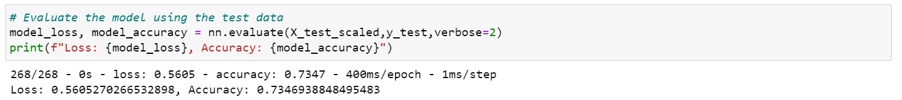

# Neural Network Analysis

## Overview of the analysis
 
In this project, I intend to develop a predictive model that helps Alphabet Soup, an investment company, to make its future investment decisions with more accuracy. In particular, I will use a CSV file (charity_data.csv located in the Resources folder) including details such as affilitation, organization type, usecase, etc. about the company's on which Alphbet Soup had previously invested, and build up a binary classifier on a neural network model to make future predictions. In doing so, I will use different libaries including Pandas, SKlearn, and Tensorfelow, and write Python codes in Jupyter Notebook to implement and run the model. Specifically, I will first read the CSV file, conduct data preprocessing (removing irrelevant columns, checking for binning options, encoding categorical features, splitting data to training and test subsets, and scaling the input features). Next, I will create and complie the neural network model by initializing an instance of the model followed by adding input, output, and hidden layers to the model, and compiling the model using a binary classifier optimizer. Then, I will evaluate and report the model accuracy (a checkpoint folder is also created and the training results are stored in a .h5 file for future references). Finally, I will complement this process by trying different optimization solutions (e.g., modifying the neural network model's sructure) to enhance the model accuaracy (the .ipynb files in the Resources folder).
 
## Results

1. Data Preprocessing
   * What variable(s) are considered the target(s) for your model?
    - In this model I considered the "IS_SUCCESSFUL" feature as the target variable.
  
   * What variable(s) are considered to be the features for your model?
    - All other variables except the target variable, and those removed in the preprocessing part are used as inputs (features) in the model. Note: 
   
   * What variable(s) are neither targets nor features, and should be removed from the input data?  
    - I truned "INCOME_AMT" to a categorical variable due to its improper format.
  
  
  - 'APPLICATION_TYPE', 'AFFILIATION', 'CLASSIFICATION', 'USE_CASE', 'ORGANIZATION', 'SPECIAL_CONSIDERATIONS', "INCOME_AMT"
   
- "EIN", "NAME" were removed from the model.
 
- As was instructed, in the initial model I entered a single input layer, two hidden layers (first layer: 80 neurons" and the second layer: 30 neurons), and one output layer.
 
- The initial model achieved an accuracy of **72.69%** which was close to the specified 75% accuracy limit.
 
- I tried different changes to the input data and the model to increase the model accuracy. First, I changed the "INCOME_AMT" feature's type to object due to its improper format. Then, I increased the number of bins for categorical variables with more than 10 unique values to allow for inclusion of more nuances in the model. I also added a third hidden layer (also checked 4 and 5 hidden layers which were not helpful), increased the number of neurons in the hidden layers (up to 300), increased the number of epochs (up to 200), and modified activation functions. Finally, I also tested other optimizers (adamx and Nadam). Unfortunately, none of the changes made could increase model accuracy (**73.47%** accuracy of the optimized model) to above 75%. Below I added the screenshot of the accuracy output for the base and optimized models.
 
### Base model result

 
### Optimized model result

## Summary

Below are a summary of the results obtained after all analyses.

1. The ReLU activation function proved to be the best for hidden layers and sigmoid the best function for the output layer.
2. The model accuracy only slightly improved when the number of neurons per hidden layer increased.
3. Adding additional hidden layer was only effective when the third layer was added.
4. Increasing the number of epoch could slightly improve the model accuracy.
5. Although minutely, additional number of bins were helpful in increasing the model performance.

### Recommendation

It looks that the model hardly can be improved using the available data. To enhance model performance I suggest that the company either use a larger dataset with additional features that allow the model to decipher the inherent complexity of the data or alternatively employ another modeling technique such as super vector machines or random forrest to see if the they result in higher performance (given their potential to deal with lower number of datapoints and features).
